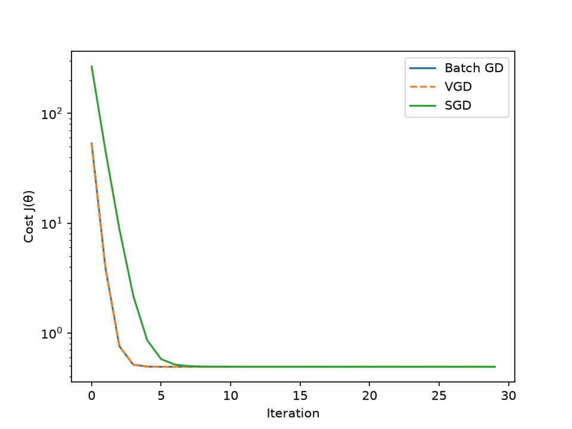

# Lec 2 — Linear regression, LMS, normal equations

## Derivations
- Cost Function:
  
$$J(\theta) = \frac{1}{2}\sum_{i=1}^{m}(h_\theta(x^{(i)}) - y^{(i)})^2$$

- Cost Function (Matrix Form):
  
$$J(\theta) = \frac{1}{2}(X\theta - \vec{y})^T(X\theta - \vec{y})$$

- Gradient:

$$\frac{\partial J}{\partial \theta_j} = \sum_{i=1}^{m}(h_\theta(x^{(i)}) - y^{(i)})x_j^{(i)}$$

- Update Rule:

$$\theta_j := \theta_j - \alpha\sum_{i=1}^{m}(h_\theta(x^{(i)}) - y^{(i)})x_j^{(i)}$$ 

- Update Rule(Stochastic):

$$\theta_j := \theta_j - \alpha(h_\theta(x^{(i)}) - y^{(i)})x_j^{(i)}$$

- Vectorized form:
    
$$\theta := \theta - \alpha X^T(X\theta - y)$$

- Normal Equation:

$$\theta = (X^TX)^{-1}X^T\vec{y}$$

## Implementations
| Function | Formula | Description | Notes |
|---|---|---|---|
| `compute_cost` | $J(\theta) = \frac{1}{2}\sum_{i=1}^{m}(h_\theta(x^{(i)}) - y^{(i)})^2$ | scalar cost | explicit loop over examples |
| `compute_cost_vect` | $J(\theta) = \frac{1}{2}(X\theta - \vec{y})^T(X\theta - \vec{y})$ | matrix cost | uses zᵀz identity |
| `LMS` | $\theta_j := \theta_j - \alpha\sum_{i=1}^{m}(h_\theta(x^{(i)}) - y^{(i)})x_j^{(i)}$ | batch gradient descent | nested loops over j then i |
| `LMS_vector` | $\theta := \theta - \alpha X^T(X\theta - y)$ | vectorised batch GD | same algorithm as `LMS`, one line for the gradient |
| `SGD` | $\theta_j := \theta_j - \alpha(h_\theta(x^{(i)}) - y^{(i)})x_j^{(i)}$ | stochastic gradient descent | updates per example, m times per epoch |
| `normal_equation` | $\theta = (X^TX)^{-1}X^T\vec{y}$ | closed form | `np.linalg.solve`, not explicit inverse |

## Results
```
Actual cost:                     0.513127489532022
Actual cost using matrix form:   0.513127489532022
Cost using BGD:                  0.4915047815375432
LMS (loops):                     0.330s
Cost using BGD_vector:           0.4915047815375429
LMS (vector):                    0.004s
Cost using SGD:                  0.49260511028361403
Cost at normal eq theta:         0.4915047815375419

GD:         [ 5.00876773  2.0005595  -2.99302072  0.48025007]
GD_vector:  [ 5.00876773  2.0005595  -2.99302072  0.48025007]
SGD:        [ 5.00443066  2.00010088 -2.99263849  0.4778297 ]
Normal:     [ 5.00876773  2.0005595  -2.99302072  0.48025007]
True:       [ 5.   2.  -3.   0.5]
```

Batch GD, its vectorised twin, and the closed form agree to 8 decimal places.
SGD lands close but not identical — it oscillates near the minimum rather than
settling there.

Vectorising the gradient is **82× faster** (0.330s → 0.004s) for the same 500
iterations and the same result.



The plot shows the first 30 iterations on a log y-axis. Batch GD and the
vectorised version trace each other exactly. SGD starts higher because its
first recorded cost comes after a full epoch of 100 individual updates, not
after one batch step — the x-axes are not directly comparable.

